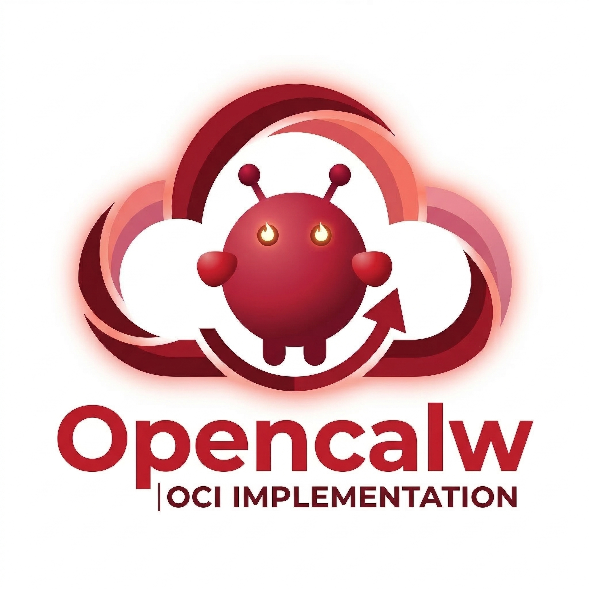
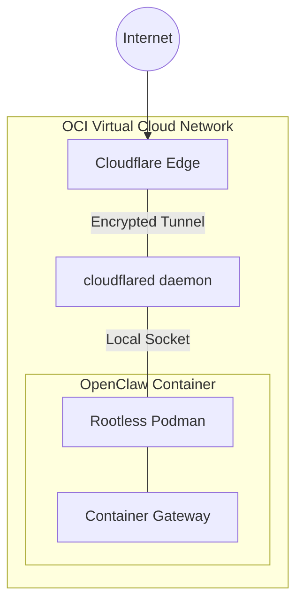

<p align="center"></p>

# OpenClaw Container Gateway


A production-grade, secure, and cost-effective container gateway running on Oracle Cloud Infrastructure (OCI) Always Free ARM (Ampere A1).

## Project Overview



OpenClaw simplifies the deployment and management of containerized services by leveraging OCI's high-performance ARM compute and Cloudflare's secure tunneling. This setup emphasizes **Rootless Security**, **Keyless Authentication**, and **Zero-Downtime Operations**.

### Key Features
- **4 OCPU / 24 GB RAM**: High-performance compute on OCI's Ampere A1 shape.
- **Zero-Trust Ingress**: Exposed solely via Cloudflare Tunnels (no open ingress ports).
- **Rootless Podman**: Containers run in user space for maximum security.
- **Systemd Integration**: Rootless containers are managed as user-level services with auto-restart.
- **Infrastructure as Code**: Fully provisioned via OpenTofu (HCL).

---

## Getting Started

### 1. Prerequisites
- [OCI Account](https://www.oracle.com/cloud/free/) (Always Free).
- [OpenTofu](https://opentofu.org/docs/intro/install/) installed locally.
- [Cloudflare Account](https://dash.cloudflare.com/) (Free tier).

### 2. Infrastructure Setup
Configuration is stored in the `infra/` directory.

1. Create a `.env` file from the example:
   ```bash
   cp .env.example .env
   ```
2. Populate the `.env` with your OCI OIDC session credentials.
3. Populate `infra/terraform.tfvars` with your Compartment ID and AD name.
4. Run the automated deployment:
   ```bash
   make infra-init
   make infra-plan
   make infra-test    # Optional: Run structure validations
   make infra-apply
   ```

### 3. Capacity Hunting
If OCI returns an "Out of host capacity" error (common for Always Free regions), use our custom retry loop:
```bash
./infra-launch-loop.sh
```

### 4. CI/CD Pipeline & Testing
This project strictly enforces infrastructure validation via a GitHub Actions CI pipeline (`.github/workflows/infra-ci.yml`).
- **Local Pre-commit:** Run `pre-commit install` locally to ensure OpenTofu formatting and basic sanitization before pushing to GitHub.
- **Continuous Integration:** Any push to a feature branch (`feat/*`, `fix/*`, `chore/*`) or Pull Request automatically triggers the pipeline. It performs `tofu validate`, native OpenTofu structural mocks (`tofu test`), and Checkov security scans. Because tests operate entirely on mocks, the pipeline requires no live OCI credentials.

---

## Documentation Index
- [Architecture Guide](docs/architecture.md): Deep dive into the security and stack.
- [Operations Manual](docs/operations.md): Managing rootless containers and updates.

## License
MIT
