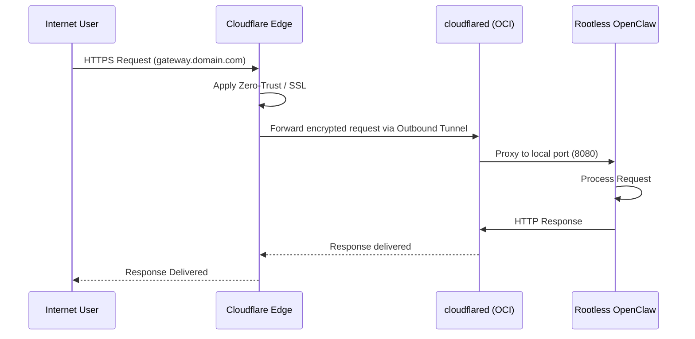

# Architecture: OpenClaw Container Gateway

This document outlines the security-first architecture of the OpenClaw Container Gateway.

## Security & Traffic Flow

## The Stack

### Infrastructure Layer (OCI)
- **Shape**: `VM.Standard.A1.Flex` (Ampere A1).
- **Region**: `us-chicago-1` (ORD).
- **Isolation**: VCN with strict ingress rules. Only TCP 22 (SSH) is permitted, and ideally, only from known administrator IPs.
- **Provisioning**: Managed via OpenTofu (HCL). All changes are validated through a mock-based CI pipeline (`infra-ci.yml`) and Checkov security scans before merging to `dev` or `main`.

### Compute Layer (OCI Native)
- **OS**: Ubuntu 24.04 LTS (AArch64).
- **Runtime**: Node.js 22 (Native).
- **Deployment**: Installed via official `install.sh` script for direct hardware access and maximum performance on ARM.
- **Service**: Managed via `systemd --user openclaw-gateway.service`.

### Ingress Layer (Cloudflare Tunnel)
- **Zero-Inbound**: No application ports (80, 443, etc.) are open on the OCI VCN.
- **cloudflared**: A service running on the host establishes an outbound tunnel to Cloudflare Edge.
- **Protocol**: **HTTP2** (forced via `--protocol http2` for OCI network compatibility).
- **Proxying**: Traffic flows from `User -> Cloudflare Edge -> Tunnel (port 18789) -> Native OpenClaw`.

### Application Layer (OpenClaw)
- **Service**: Managed via `openclaw gateway` commands.
- **UI Port**: 18789 (Local Only).
- **Auth**: Password authentication with one-time device pairing (`openclaw devices approve`).
- **Persistence**: Data stored in `/home/ubuntu/.openclaw`.

## Networking Data Flow

1.  **Request**: An external user hits `openclaw.ezetina.com`.
2.  **Edge Routing**: Cloudflare handles SSL termination and Zero-Trust policies.
3.  **Tunnel**: The request is routed via the established `cloudflared` tunnel to the OCI instance using the HTTP2 protocol.
4.  **Local Delivery**: `cloudflared` forwards the request to the local OpenClaw endpoint at `localhost:18789`.
