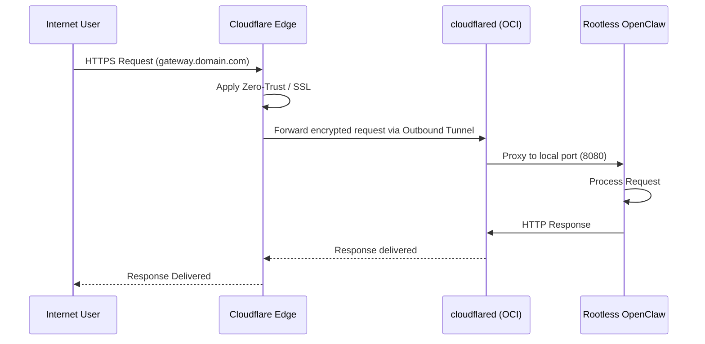

# Architecture: OpenClaw Container Gateway

This document outlines the security-first architecture of the OpenClaw Container Gateway.

## Security & Traffic Flow

## The Stack

### Infrastructure Layer (OCI)
- **Shape**: `VM.Standard.A1.Flex` (Ampere A1).
- **Region**: `us-chicago-1` (ORD).
- **Isolation**: VCN with strict ingress rules. Only TCP 22 (SSH) is permitted, and ideally, only from known administrator IPs.

### Compute Layer (Debian/Ubuntu)
- **OS**: Ubuntu 22.04 LTS (AArch64).
- **Identity**: Dedicated `ubuntu` user for container management.
- **Lingering**: Systemd lingering is enabled (`loginctl enable-linger ubuntu`), allowing the user-space services to persist across reboots without a manual login.

### Ingress Layer (Cloudflare Tunnel)
- **Zero-Inbound**: No application ports (80, 443, etc.) are open on the OCI VCN.
- **cloudflared**: A service running on the host establishes an outbound tunnel to Cloudflare Edge.
- **Proxying**: Traffic flows from `User -> Cloudflare Edge -> Tunnel -> local container`.

### Container Layer (Rootless Podman)
- **Runtime**: Podman (Daemonless, Rootless).
- **Security**:
  - `--cap-drop=ALL`: Minimizes the container's kernel capabilities.
  - `--security-opt no-new-privileges`: Prevents escalation within the container.
  - **User Namespace**: The root user inside the container is mapped to the unprivileged `ubuntu` user on the host.

## Networking Data Flow

1.  **Request**: An external user hits `gateway.yourdomain.com`.
2.  **Edge Routing**: Cloudflare handles SSL termination and Zero-Trust policies.
3.  **Tunnel**: The request is routed via the established `cloudflared` tunnel to the OCI instance.
4.  **Local Delivery**: `cloudflared` forwards the request to the local container endpoint (typically port 8080/443 within the Podman bridge).
