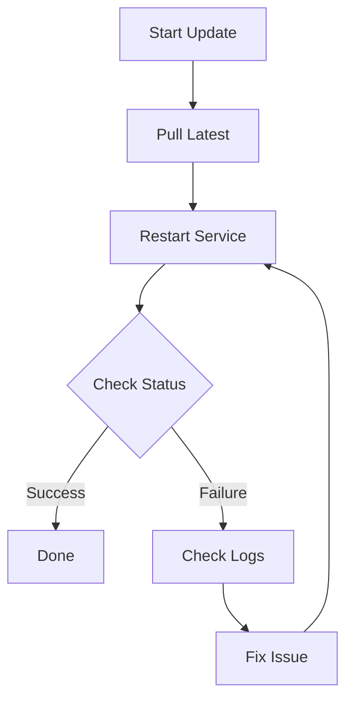

<p align="center"></p>

# Operations Manual: Managing OpenClaw




This guide covers maintenance and operational tasks for the OpenClaw gateway.

## Accessing the Host
Use your dedicated SSH key to connect:
```bash
ssh -i ~/.ssh/openclaw_rsa ubuntu@<instance_ip>
```

## Service Management
Since we use Rootless Podman, you must interact with the User-level systemd instance.

### Viewing Status
```bash
systemctl --user status openclaw.service
systemctl --user status cloudflared.service
```

### Checking Container Logs
Standard podman commands work for the current user:
```bash
podman logs -f openclaw
```

### Updating OpenClaw
1. Pull the latest image:
   ```bash
   podman pull docker.io/openclaw/openclaw:latest
   ```
2. Restart the service to swap containers:
   ```bash
   systemctl --user restart openclaw.service
   ```

## Cloudflare Tunnel Setup
After the first launch, you must authorize the cloudflared tunnel.

1. On your Mac, create the tunnel in the Cloudflare Dashboard (Access -> Tunnels).
2. Grab the TUNNEL_TOKEN.
3. Put the token in a secure location on the host:
   ```bash
   mkdir -p ~/.openclaw
   echo "YOUR_TOKEN" > ~/.openclaw/tunnel_token
   ```
4. Restart the tunnel service:
   ```bash
   systemctl --user restart cloudflared.service
   ```

## Infrastructure Testing
When adding new resources to the `infra/` folder, you must add structural validations inside `infra/tests/` using `.tftest.hcl` files.
You can run the test suite natively with OpenTofu:
```bash
make infra-test
```
This requires no physical infrastructure interactions due to its `command = plan` setup and mock bindings.

### Continuous Integration
We rely on a GitHub Actions pipeline (`.github/workflows/infra-ci.yml`) to automatically validate infrastructure on every commit and Pull Request modifying the `infra/` directory.
The pipeline runs the following verification steps:
1. `tofu fmt -check`: Enforces consistent styling.
2. `tofu validate`: Verifies syntax and configuration validity.
3. `tofu test`: Replays your OpenTofu `.tftest.hcl` tests against mocked infrastructure, guaranteeing there are no breaking structural changes.
4. `Checkov Scan`: Analyzes the OpenTofu code to spot potential security misconfigurations.

If any of these steps (formatting, validation, testing, or the Checkov scan) fail, the pipeline will fail and block merging.

Since the tests use mocks, the pipeline does not attempt to deploy live resources, and it will never fail because of missing local infrastructure credentials or properties.

### Pre-commit Hooks
To catch styling and basic structural issues immediately before you push to GitHub, we have configured `pre-commit` hooks.
Install the `pre-commit` utility locally (e.g. `brew install pre-commit` or `pip install pre-commit`), then run:
```bash
pre-commit install
```
Locally, these hooks only perform lightweight and fast checks (like `tofu fmt` and file sanitization) so they don't block your local workflow due to missing credentials. The heavier structural validations, tests, and Checkov security scans are intentionally deferred to the GitHub Actions CI pipeline.

## Troubleshooting
- Logs: journalctl --user -u openclaw.service
- Socket Errors: Ensure XDG_RUNTIME_DIR is set when running commands manually. (This is handled automatically by the cloud-init login script).
