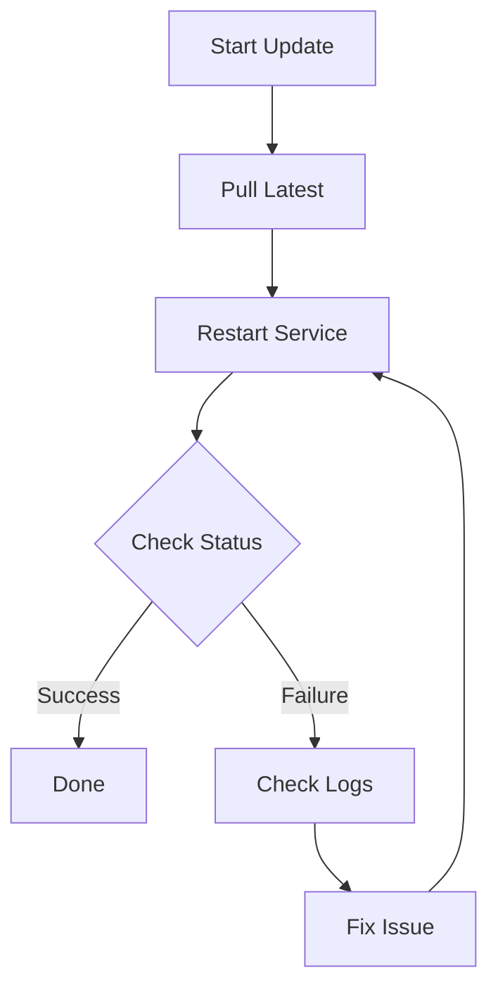

<p align="center"></p>

# Operations Manual: Managing OpenClaw




This guide covers maintenance and operational tasks for the OpenClaw gateway.

## Accessing the Host
Use your dedicated SSH key to connect:
```bash
ssh -i ~/.ssh/openclaw_rsa ubuntu@<instance_ip>
```

## Service Management
Since we use a native installation, you must interact with the User-level systemd instance for both the gateway and the tunnel.

### Viewing Status
```bash
openclaw gateway status
systemctl --user status cloudflared.service
```

### Checking Logs
```bash
journalctl --user -u openclaw-gateway.service -f
journalctl --user -u cloudflared.service -f
```

### Updating OpenClaw
1. Run the official update/installer:
   ```bash
   curl -sSL https://raw.githubusercontent.com/openclaw/openclaw/main/install.sh | bash
   ```
2. Restart the gateway service:
   ```bash
   openclaw gateway start
   ```

## Cloudflare Tunnel Setup
The tunnel is managed via the `cloudflared` service. To deploy or update your tunnel token from your local Mac:

1. Ensure the token is in `~/.openclaw/tunnel_token` on your Mac.
2. Run the deployment target:
   ```bash
   make deploy-token
   ```
This will automatically SSH into the instance, update the token, and restart the `cloudflared` service with the correct protocol (`--protocol http2`).

## Device Pairing (Security)
For security, new browsers connecting via `https://openclaw.ezetina.com` must be "paired" with the gateway.
1. When you see "Pairing Required" in the browser, refresh the page.
2. On your OCI instance, approve the latest request:
   ```bash
   openclaw devices approve --latest
   ```

## Infrastructure Testing
When adding new resources to the `infra/` folder, you must add structural validations inside `infra/tests/` using `.tftest.hcl` files.
You can run the test suite natively with OpenTofu:
```bash
make infra-test
```
This requires no physical infrastructure interactions due to its `command = plan` setup and mock bindings.

### Continuous Integration
We rely on a GitHub Actions pipeline (`.github/workflows/infra-ci.yml`) to automatically validate infrastructure on every commit and Pull Request modifying the `infra/` directory.
The pipeline runs the following verification steps:
1. `tofu fmt -check`: Enforces consistent styling.
2. `tofu validate`: Verifies syntax and configuration validity.
3. `tofu test`: Replays your OpenTofu `.tftest.hcl` tests against mocked infrastructure, guaranteeing there are no breaking structural changes.
4. `Checkov Scan`: Analyzes the OpenTofu code to spot potential security misconfigurations.

If any of these steps (formatting, validation, testing, or the Checkov scan) fail, the pipeline will fail and block merging.

Since the tests use mocks, the pipeline does not attempt to deploy live resources, and it will never fail because of missing local infrastructure credentials or properties.

### Pre-commit Hooks
To catch styling and basic structural issues immediately before you push to GitHub, we have configured `pre-commit` hooks.
Install the `pre-commit` utility locally (e.g. `brew install pre-commit` or `pip install pre-commit`), then run:
```bash
pre-commit install
```
Locally, these hooks only perform lightweight and fast checks (like `tofu fmt` and file sanitization) so they don't block your local workflow due to missing credentials. The heavier structural validations, tests, and Checkov security scans are intentionally deferred to the GitHub Actions CI pipeline.

## Troubleshooting
- **Error 1033 (Cloudflare)**: Usually means the tunnel is failing to connect. Ensure the service is running with `--protocol http2`.
- **Pairing Issues**: Ensure you have run `openclaw devices approve --latest` after attempting to connect.
- **Port Conflicts**: Ensure no other service is using port `18789`.
